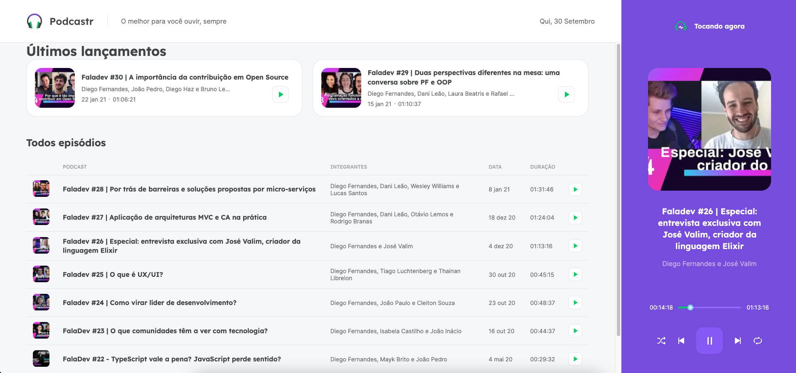

<div align="center">
  
</div>

---



## 🚀 Tecnologies

<div align="center">
  <br />
</div>

This project was developed using cutting edge front-end technologies.

- [Next.js](https://nextjs.org/)
- [Sass](https://sass-lang.com/)
- [TypeScript](https://www.typescriptlang.org/)
- [Axios](https://github.com/axios/axios)
- [date-fns](https://date-fns.org/)
- [ESLint](https://eslint.org/)
- [Prettier](https://prettier.io/)
- [JSON Server](https://github.com/typicode/json-server)
- [rc-slider](https://www.npmjs.com/package/rc-slider)

## 💻 Getting started

### Requirements

**Clone the project and access the folder**

```bash
$ git clone https://github.com/leolivm/podcastr.git && cd podcastr
```

**Follow the steps below**

```bash
# Install the dependencies
$ yarn

# Run the json server fake API
$ yarn server

# Run the web client
$ yarn dev
```

The app will be available for access on your browser at `http://localhost:3000`

---

Made with 💜 by Leandro Martins 👋 [See my linkedin](https://www.linkedin.com/in/leandro-martins-0640921a4/)
